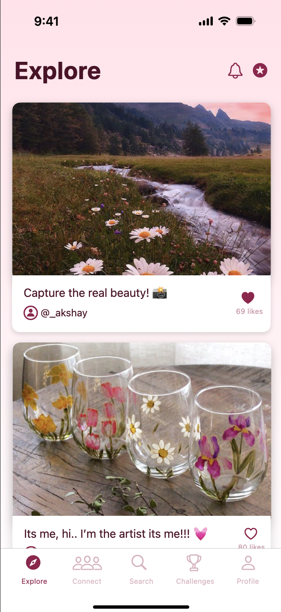
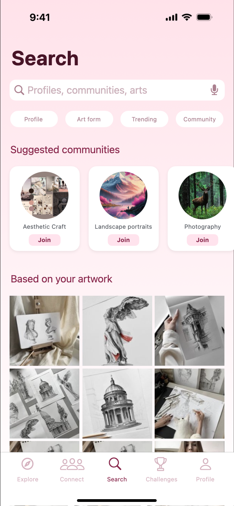
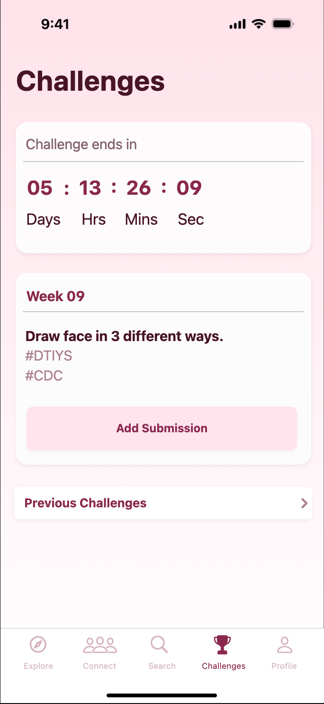
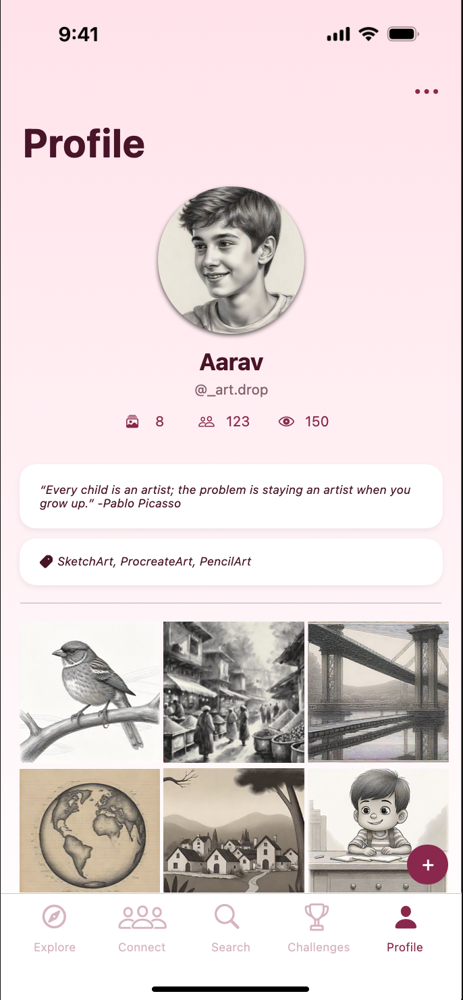

# **Artistico - iOS App for Visual Artists**

## **Overview**

**Artistico** is an iOS application designed to be the ultimate platform for visual artists. It allows users to connect with peer artists from around the globe, display their artworks, join artistic communities, participate in creative challenges, and build a perfect portfolio. The app was developed under the mentorship of Galgotias University and is now being showcased as a testament to the developers' skills.

## **Features**

- **Connect with Artists**: Engage with artists from different corners of the world. Share ideas, artworks, and inspiration with a like-minded community.
  
- **Explore Artworks**: Browse and expand your imagination with a display of the best artworks uploaded by artists in the community.

- **Join Communities**: Be a part of artistic communities that match your interests. Collaborate and grow your artistic network.

- **Creative Challenges**: Participate in challenges designed to push the boundaries of your creativity. Showcase your skills and get recognition from your peers.

- **Portfolio Creation**: Build and showcase your portfolio within the app. Display your best work in an aesthetically pleasing layout.

## **App Flow and Screens**

### **1. Explore Tab**

  <table>
    <tr>
      <td width="50%">
        

          The **Explore** tab is the heart of the Artistico app, serving as the first touchpoint for users upon launching the application. It presents a curated feed of artworks shared by artists within the community, providing a visual journey through various styles, mediums, and creative expressions. This tab encourages interaction; users can like, comment, and share their thoughts on artworks, fostering a sense of community. The upper section prominently displays featured content, such as ongoing challenges or highlighted artists, ensuring that users stay updated with the latest trends and opportunities within the app. The Explore tab is designed to inspire creativity and offer endless exploration possibilities.
        

      </td>
      <td width="50%">
        
      </td>
    </tr>
  </table>

### **2. Connect Tab**

  <table>
    <tr>
      <td width="50%">
        
      </td>
      <td width="50%">
        

          The **Connect** tab, labeled as *"Community"* within the app, is the social hub where artists from around the globe come together to share ideas, discuss various topics, and provide feedback on each other's work. The interface resembles a blend of a chatroom and a forum, allowing for both real-time discussions and ongoing threads. Users can join multiple communities based on their interests, whether it's specific art forms, techniques, or broader artistic discussions. The search functionality at the top of this tab helps users find and join new communities quickly. This tab is essential for building relationships and expanding one's network within the Artistico platform.
        

      </td>
    </tr>
  </table>

### **3. Search Tab**

  <table>
    <tr>
      <td width="50%">
        

          The **Search** tab is designed for discovery, offering users an intuitive way to explore the vast content available within Artistico. Whether users are looking for specific artists, communities, or types of artwork, the search tab provides a powerful tool to find exactly what they need. The interface is segmented into sections like *"Suggested Communities"* and *"Based on Your Artwork,"* which offer personalized recommendations tailored to each user's preferences and past activities. This feature enhances the user experience by making it easier to connect with relevant content and artists, ensuring that users can continuously find new inspiration and expand their artistic horizons.
        

      </td>
      <td width="50%">
        
      </td>
    </tr>
  </table>

### **4. Challenges Tab**

  <table>
    <tr>
      <td width="50%">
        
      </td>
      <td width="50%">
        

          The **Challenges** tab is where the competitive and creative aspects of Artistico truly shine. Here, users can participate in weekly or monthly challenges that are designed to push their creative limits. Each challenge is accompanied by a countdown timer, ensuring that participants are aware of submission deadlines. Users can submit their artwork directly through this tab and view submissions from other artists, fostering a healthy competitive environment. The challenges range in difficulty and scope, offering something for everyone, from beginners to seasoned artists. This tab not only encourages continuous artistic growth but also helps users gain visibility and recognition within the community.
        

      </td>
    </tr>
  </table>

### **5. Profile Tab**

  <table>
    <tr>
      <td width="50%">
        

          The **Profile** tab is the personal space where users can showcase their artistic journey. This section allows users to manage and update their portfolios, displaying their best work in a visually appealing grid layout. The tab also features the user's avatar, bio, and social stats, including followers, views, and engagement on their artwork. Tags can be added to each piece to categorize the work and make it easier for others to discover. The Profile tab is crucial for artists who wish to build and maintain a professional presence within the Artistico community, acting as both a personal gallery and a resume for prospective collaborations or opportunities.
        

      </td>
      <td width="50%">
        
      </td>
    </tr>
  </table>

## **Development Team**

Artistico was developed by a team of four dedicated developers:

  <table>
    <tr>
      <td align="center">
         
        <b>Aditya Kumar Gupta</b>
      </td>
      <td align="center">
         
        <b>Prateek Kumar Rai</b>
      </td>
      <td align="center">
         
        <b>Aida Sharon Bruce</b>
      </td>
      <td align="center">
         
        <b>Roshan Karn</b>
      </td>
    </tr>
  </table>

## **Mentorship**

This project was developed under the mentorship of Galgotias University and was later handed over to the university as a completed project.

## **Availability**

Artistico will be available on the App Store very soon. Stay tuned for updates!

## **License**

This project is licensed under the MIT License - see the [LICENSE](LICENSE) file for details.

## **Acknowledgements**

We extend our gratitude to Galgotias University for providing mentorship and support throughout the development of this project.
